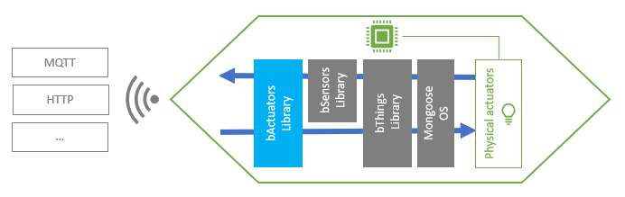

# bActuators Library
## Overview
A bActuator offers a common set of APIs for managing any kind of physical actuator. This allows your firmware interacting with actuators without take care of their hardware caratteristics.


## Features
- **Universal value-types** - You can set or read any actuator state value within the supported [bVariant](https://github.com/diy365-mgos/bvar) data-types.
- **GPIO as actuators** - You can easily read and write GPIO as actuators. Just include the [bThings GPIO library](https://github.com/diy365-mgos/bthing-gpio) in your project.
## Get Started in C/C++
Copy, build and flash one of the following ready-to-use firmwares.
#### Example 1 - Toggle GPIO state
Create a bActuator for toggling the GPIO #2 state.

Include these libraries in your `mos.yml` file.
```yaml
libs:
  - origin: https://github.com/diy365-mgos/bactuator
  - origin: https://github.com/diy365-mgos/bthing-gpio
```
```c
#include "mgos.h"
#include "mgos_bactuator.h"
#include "mgos_bthing_gpio.h"

static int gpio_pin = 2; // LED GPIO

static void actuator_state_changed_cb(int ev, void *ev_data, void *userdata) {
  struct mgos_bthing_state *arg = (struct mgos_bthing_state *)ev_data;

  LOG(LL_INFO, ("Actuator '%s' (on GPIO %d) state: %s",
    mgos_bthing_get_uid(arg->thing), gpio_pin, (mgos_bvar_get_bool(arg->state) ? "ON" : "OFF")));
}

static mgos_bvar_t new_state;
void simulate_external_trigger(void *param) {
  mgos_bthing_t thing = MGOS_BACTUATOR_THINGCAST((mgos_bactuator_t)param);
  mgos_bvar_set_bool(new_state, mgos_bvar_get_bool(mgos_bthing_get_state(thing)) ? false : true);
  mgos_bthing_set_state(thing, new_state);
}

enum mgos_app_init_result mgos_app_init(void) {
  new_state = mgos_bvar_new();
  mgos_event_add_handler(MGOS_EV_BTHING_STATE_CHANGED, actuator_state_changed_cb, NULL);

  /* create the actuator */
  mgos_bactuator_t actu = mgos_bactuator_create("actu1", NULL);
  /* attach GPIO  */
  mgos_bthing_gpio_attach(MGOS_BACTUATOR_THINGCAST(actu), gpio_pin, false, MGOS_BTHING_GPIO_PULL_AUTO);
  
  // Simulate an external trigger for changing actuator state
  mgos_set_timer(5000, MGOS_TIMER_REPEAT, simulate_external_trigger, actu);
  
  return MGOS_APP_INIT_SUCCESS;
}
```
## C/C++ APIs Reference
### Inherited bThing APIs
A bActuator inherits [bThing](https://github.com/diy365-mgos/bthing) APIs.
- [mgos_bthing_get_uid()](https://github.com/diy365-mgos/bthing#mgos_bthing_get_uid)
- [mgos_bthing_on_get_state()](https://github.com/diy365-mgos/bthing#mgos_bthing_on_get_state)
- [mgos_bthing_get_state()](https://github.com/diy365-mgos/bthing#mgos_bthing_get_state)
- [mgos_bthing_on_set_state()](https://github.com/diy365-mgos/bthing#mgos_bthing_on_set_state)
- [mgos_bthing_on_updating_state()](https://github.com/diy365-mgos/bthing#mgos_bthing_on_updating_state)
- [mgos_bthing_set_state()](https://github.com/diy365-mgos/bthing#mgos_bthing_set_state)
- All other [bThings core library](https://github.com/diy365-mgos/bthing) APIs...
### Inherited bSensor APIs
A bActuator inherits [bSensor](https://github.com/diy365-mgos/bsensor) APIs.
- [mgos_bsensor_update_on_poll()](https://github.com/diy365-mgos/bsensor#mgos_bsensor_update_on_poll)

*WARNING*: [mgos_bsensor_update_on_int()](https://github.com/diy365-mgos/bsensor#mgos_bsensor_update_on_int) doesn't support bActuators. If invoked passing a bActuator it returns `false`.
### MGOS_BACTUATOR_TYPE
```c
#define MGOS_BACTUATOR_TYPE
```
The bActuator type ID. It can be used with [mgos_bthing_is_typeof()](https://github.com/diy365-mgos/bthing#mgos_bthing_is_typeof).

Example:
```c
mgos_bactuator_t actu = mgos_bactuator_create(...);
if (mgos_bthing_is_typeof(MGOS_BACTUATOR_THINGCAST(actu), MGOS_BACTUATOR_TYPE))
  LOG(LL_INFO, ("I'm a bActuator."));
if (mgos_bthing_is_typeof(MGOS_BACTUATOR_THINGCAST(actu), MGOS_BTHING_TYPE_ACTUATOR))
  LOG(LL_INFO, ("I'm a bThing actuator."));
if (mgos_bthing_is_typeof(MGOS_BACTUATOR_THINGCAST(actu), MGOS_BSENSOR_TYPE))
  LOG(LL_INFO, ("I'm a bSensor."));
if (mgos_bthing_is_typeof(MGOS_BACTUATOR_THINGCAST(actu), MGOS_BTHING_TYPE_SENSOR))
  LOG(LL_INFO, ("I'm a bThing sensor."));
```
Output console:
```bash
I'm a bActuator.
I'm a bThing actuator.
I'm a bSensor.
I'm a bThing sensor.
```
### MGOS_BACTUATOR_THINGCAST
```c
mgos_bthing_t MGOS_BACTUATOR_THINGCAST(mgos_bactuator_t actuator);
```
Casts a bActuator to a generic bThing to be used with [inherited bThing APIs](#inherited-bthing-apis).

|Parameter||
|--|--|
|actuator|A bActuator.|

Example:
```c
mgos_bactuator_t actu = mgos_bactuator_create(...);
LOG(LL_INFO, ("%s successfully created.", mgos_bthing_get_uid(MGOS_BACTUATOR_THINGCAST(actu))));
```
### MGOS_BACTUATOR_SENSCAST
```c
mgos_bsensor_t MGOS_BACTUATOR_SENSCAST(mgos_bactuator_t actuator);
```
Casts a bActuator to a bSensor to be used with [inherited bSensor APIs](#inherited-bsensor-apis).

|Parameter||
|--|--|
|actuator|A bActuator.|

Example:
```c
mgos_bactuator_t actu = mgos_bactuator_create(...);
mgos_bsensor_update_on_int(MGOS_BACTUATOR_SENSCAST(actu), gpio_pin,
  MGOS_GPIO_PULL_UP, MGOS_GPIO_INT_EDGE_ANY, 50);
```
### mgos_bactuator_create
```c
mgos_bactuator_t mgos_bactuator_create(const char *id, const char *domain);
```
Creates a bActuator. Returns `NULL` on error.

|Parameter||
|--|--|
|id|The bActuator ID.|
|domain|The domain name or `NULL`.|
## To Do
- Implement javascript APIs for [Mongoose OS MJS](https://github.com/mongoose-os-libs/mjs).
